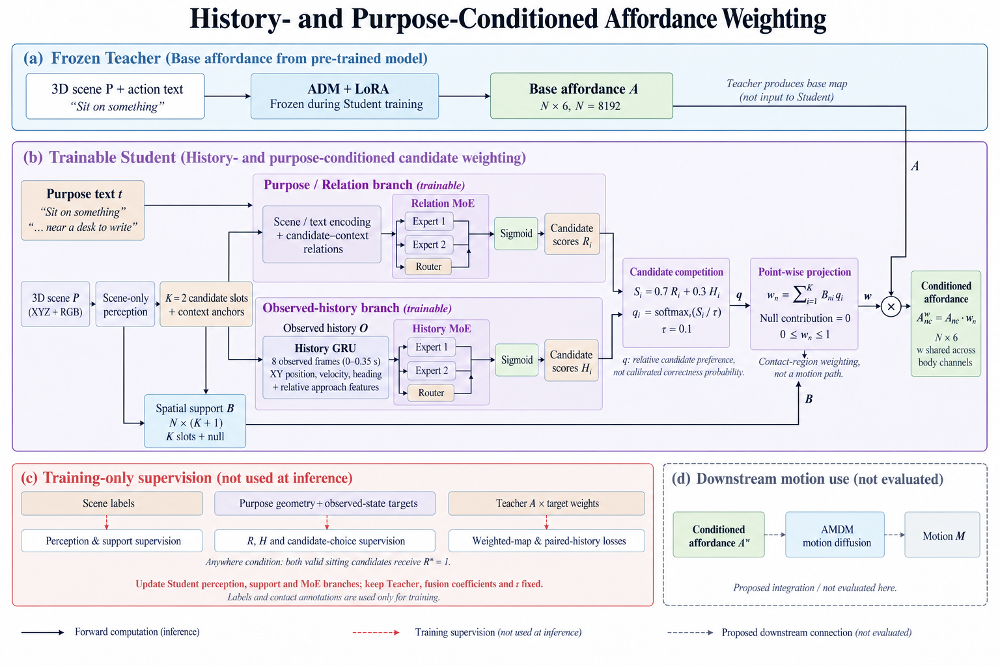
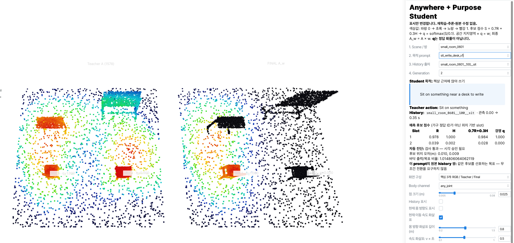
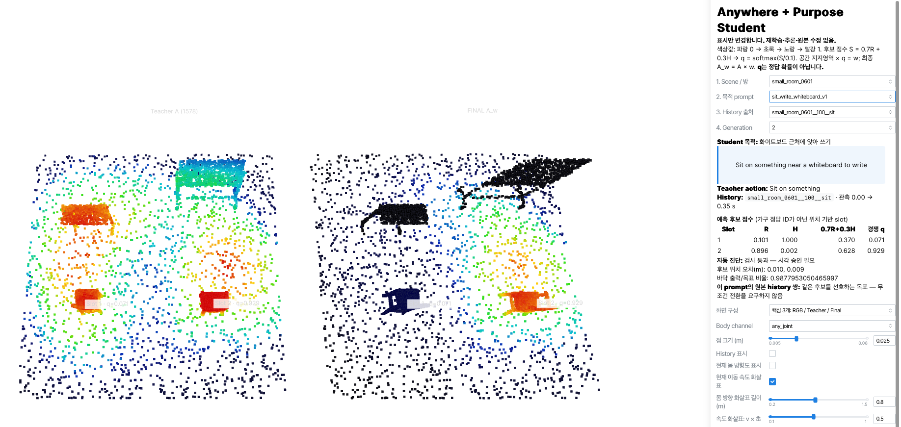

# ADM-MoE-Teacher
## SmallRoom30: History- and Purpose-Conditioned Affordance

Teacher LoRA adaptation and two-branch MoE Student weighting for **30 compact 3D development scenes (6 types × 5 variants)**.

**Current status:** training completed and the project owner completed qualitative Viser review of the inspected Teacher and Student maps. This is **qualitative acceptance**, not a claim that all quantitative gates passed, that the model generalizes to unseen rooms, or that downstream motion generation was validated.

[Qualitative results — 15 screenshots](docs/results/small_room30_anywhere/VISUAL_RESULTS.md) · [Review record](docs/results/small_room30_anywhere/REVIEW_STATUS.md) · [Data and saved runs](docs/DATA_AND_CHECKPOINTS.md)



### 1. Teacher: candidate affordance

The ADM Teacher, adapted with LoRA, provides a base affordance map for the action **“Sit on something”**. The current Student experiment reuses saved Teacher checkpoint **1578** maps and keeps the Teacher fixed.

The map has 8,192 points and six body channels. Its role is to provide multiple sitting candidate regions, not to select a single destination.

### 2. Student: purpose and observed history

The Student uses scene XYZ/RGB, purpose text, and eight observed history frames (0–0.35 s; XY position, velocity and heading).

- Scene-only perception predicts candidate slots, context anchors and spatial support.
- Relation MoE predicts candidate purpose scores R.
- History GRU and History MoE predict observed-history scores H.
- Candidate competition and spatial projection produce point-wise weights:

```text
S_i   = 0.7 R_i + 0.3 H_i
q_i   = softmax_i(S_i / 0.1)
w_n   = sum_i B_ni q_i
A^w_nc = A_nc × w_n
```

There are two candidate slots plus a null support channel. Null contributes zero. The weight is shared across body channels; q is a relative preference, not calibrated correctness probability. This is contact/support-region weighting, not a path from the history starting point.

### 3. Actual Student prompts

| Condition | Text |
| --- | --- |
| Anywhere | Sit on something |
| Watch TV | Sit on something to watch TV |
| Write | Sit on something near a desk or whiteboard to write |
| Desk | Sit on something near a desk to write |
| Whiteboard | Sit on something near a whiteboard to write |

Anywhere is included in all 30 rooms. Other purposes are included where applicable; this is not five prompts in every room.

- **Anywhere:** both valid sitting candidates have relation target 1, allowing history to distinguish them.
- **Specific purpose:** candidate-to-context suitability influences selection; history does not have to override a clear purpose difference.
- **Room0601:** the broad desk-or-whiteboard prompt allows both contexts; desk-only and whiteboard-only prompts emphasize the respective candidate in the reviewed examples.




### 4. Evaluation scope

| Split | Purpose conditions | Anywhere conditions | Total |
| --- | ---: | ---: | ---: |
| Training, g0/g1 | 180 | 120 | 300 |
| Evaluation, g2 | 90 | 60 | 150 |

The same 30 development rooms occur in both splits; g identifies Teacher-generated samples. These are **not unseen-room test results**. Supervision includes geometric preference proxies, not human intent ground truth.

The gallery documents the inspected cases. Actual final run weights and machine-readable metrics have not yet been published here. Package test reports are engineering checks, not trained-model performance.

### 5. Open the accepted Student results in Viser

Use the existing Linux AMDM/afford environment **with the matching dataset and completed saved run installed**:

```bash
conda activate afford
PORT=8092 bash scripts/small_room30/student_anywhere.sh view
```

The viewer title should be **Anywhere + Purpose Student**. In a remote session, forward port 8092 and open the forwarded address. This reads saved maps; it does not train or infer. If a different output directory was used:

```bash
SUMMARY=outputs/YOUR_COMPLETED_RUN/summary.json PORT=8092 bash scripts/small_room30/student_anywhere.sh view
```

Do not edit the original summary's approval fields or hashes. Human review is recorded [separately](docs/results/small_room30_anywhere/REVIEW_STATUS.md).

### 6. Training source and prerequisites

- [Student procedure](docs/guides/student-anywhere.md)
- [Teacher saved1578 full evaluation](docs/guides/teacher-evaluation.md)
- [Data, checkpoints and reproduction limitations](docs/DATA_AND_CHECKPOINTS.md)
- [Repository scope](docs/REPOSITORY_SCOPE.md)

The Student procedure fine-tunes a completed competition Student; it is not from-scratch training. Current source requires historical initialization assets and exact dataset bindings. **A fresh clone alone cannot reproduce the reported maps.** Do not substitute old Teacher-v10.2 release assets for the SmallRoom30 runs.

The original ADM implementation, dependency files and upstream license remain in the repository. Follow the existing compatible environment; this update does not introduce a validated fresh-install environment.

### Repository layout

```text
docs/
  guides/          # Teacher / Student execution instructions
  results/         # Accepted qualitative results, figures and screenshots
  provenance/      # Original package tests and source checksums
scripts/
  small_room30/    # Current Student and Teacher launchers
  adm/             # Upstream ADM training, testing and visualization
prepare/           # Shared experiment implementation; paths kept for run integrity
configs/           # Model configuration and environment records
datasets/          # Dataset loaders
models/            # Model components
diffusion/         # Diffusion implementation
tests/             # Repository organization and standalone tool tests
```

Run upstream ADM commands from the repository root, for example
`python scripts/adm/train.py ...` or `python scripts/adm/test.py ...`.
The current Student viewer command above is unchanged.

### License and attribution

This work extends the [Affordance Diffusion Model](https://github.com/afford-motion/afford-motion). Preserve the [upstream MIT license](LICENSE) and the licenses of third-party data, pretrained models and body models. Such assets are not included in ordinary Git.

Earlier unsuccessful result showcases and duplicate patch archives were removed from the current tree. They remain recoverable from Git history; shared legacy modules used by current code remain.
