# 목적·History 조건부 3D Affordance — 정성 평가

2026-09-11 · Frozen Teacher 1578 + Anywhere/Purpose Student · 원본 Viser 캡처 15장

## 1. 실험 목적

동일한 3D 장면에서 목적 text와 관측 history가 최종 앉기 후보 선택에 어떻게 반영되는지 확인한다. Teacher는 여러 상호작용 가능 영역을 제공하고, Student는 현재 목적과 관측 상태에 적합한 후보 및 관련 공간 영역을 상대적으로 보존한다.

평가 질문은 다음과 같다.

- 목적 prompt가 바뀌면 목적에 맞게 후보 선택이 달라지는가?
- Scene과 prompt를 고정하고 history만 바꾸면 선택이 달라질 수 있는가?
- 선택된 후보와 관련 바닥 영역은 유지하고, 비선택 후보는 억제하는가?

대표 사례의 시각 확인과 전체 평가 성공률은 구분한다. 이 자료만으로 새로운 방 일반화를 주장하지 않는다.

## 2. 현재 모델 구조

입력은 장면 점군의 XYZ/RGB, purpose text, 관측 history이다. History는 8프레임(0.00–0.35초)의 위치·속도·몸 방향이며, 미래 궤적이나 최종 도착 후보 ID를 입력하지 않는다. Teacher action은 `Sit on something`으로 고정한다. 최종 map은 8,192개 점 × 6개 신체 채널이다.

- **Frozen Teacher:** 검증된 1578 체크포인트의 저장된 기본 affordance A를 사용한다. Student 학습 시 Teacher를 업데이트하지 않는다.
- **Relation MoE:** 장면, 목적 text, 예측된 후보와 목적 가구 사이의 거리 관계로 후보 점수 R을 예측한다. History를 직접 입력하지 않는다.
- **History MoE:** 장면, 관측 상태, 후보와의 상대 위치·방향·접근 정보로 후보 선호 H를 예측한다. Purpose text를 직접 입력하지 않는다.
- **학습:** 각 분기에 expert 2개와 router가 있으며, 분기별 감독 및 최종 map 감독을 통해 공동 학습한다.

현재 계산은 다음과 같다.

`S_i = 0.7 R_i + 0.3 H_i`

`q_i = softmax(S / 0.1)_i`

`w_n = Σ_i B_ni q_i`

`A^w[n,c] = A[n,c] × w_n`

B는 점별 후보 관련 공간 영역에 대한 예측값이다. 0.7/0.3은 후보 점수 결합 비율이며 이후 softmax 경쟁과 공간 가중치 변환이 들어간다. 공간 가중치 w는 6개 신체 채널에 공유된다. q는 상대 경쟁 가중치이지 정답 확률이 아니다.

## 3. 학습·평가 조건

전체 30개 개발 장면에 anywhere 조건을 추가했다.

| 구분 | 기존 목적 조건 | Anywhere | 합계 |
| --- | ---: | ---: | ---: |
| 학습 g0/g1 | 180 | 120 | 300 |
| 평가 g2 | 90 | 60 | 150 |
| 전체 | 270 | 180 | 450 |

g는 Teacher 생성 샘플 구분이다. 같은 방의 별도 생성 샘플 평가이며 unseen-room 평가가 아니다. Relation/History 목표에는 거리·방향·접근 기반 기하학적 proxy supervision이 사용되므로 사람이 부여한 의도 정답과 구분한다.

Anywhere에서는 두 유효 앉기 후보의 R 목표를 모두 1로 두고 history 및 공간 영역 감독을 유지한다. 모든 가구나 모든 바닥을 앉기 후보로 취급한다는 의미는 아니다.

### 실제 입력 prompt

| ID | 문장 |
| --- | --- |
| sit_anywhere_v1 | Sit on something |
| sit_watch_v1 | Sit on something to watch TV |
| sit_write_v1 | Sit on something near a desk or whiteboard to write |
| sit_write_desk_v1 | Sit on something near a desk to write |
| sit_write_whiteboard_v1 | Sit on something near a whiteboard to write |

`write`는 단순한 쓰기가 아니라 desk 또는 whiteboard를 명시한 조건이다. 모든 방에 모든 목적 prompt가 존재하는 것은 아니며, anywhere는 30개 방에 추가했다.

## 4. 캡처 읽는 법

아래 캡처는 모두 왼쪽 Teacher A(1578), 오른쪽 Final A^w 비교이다. Generation 2, any_joint, 점 크기 0.025m 및 고정 0–1 색상 범위를 사용한다. any_joint는 점마다 6개 채널 중 최댓값이다.

Teacher 패널의 slot/q 표시는 Student 후보 정보를 겹친 것으로, Teacher 자체의 선택 점수가 아니다. 아래 q는 화면의 반올림 값이다. 1.000을 정확한 1 또는 정답 확률 100%로 해석하지 않는다. 일부 캡처는 history 표시만 꺼져 있으며 입력 history는 우측 패널에 기록되어 있다.

## 5. Room0101 — History만 바꾼 후보 전환

Scene, anywhere prompt, g2를 고정하고 history 100에서 110으로 변경했다. R은 0.999/0.997로 동일하게 유지되며 H와 최종 q의 우세 후보가 전환된다.

| 조건 | H1 / H2 | q1 / q2 |
| --- | --- | --- |
| Anywhere + history100 | 0.999 / 0.011 | 0.951 / 0.049 |
| Anywhere + history110 | 0.054 / 0.975 | 0.060 / 0.940 |

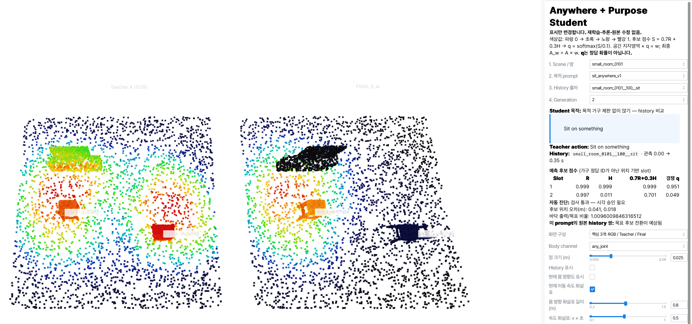

Figure 1a. `room0101.png` · Anywhere · history100. 후보1을 보존하고 후보2를 억제한다. History 표시 OFF이므로 화살표가 보이지 않지만 history 입력은 존재한다.

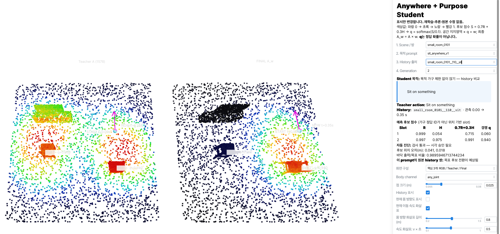

Figure 1b. `room0101_2.png` · Anywhere · history110. 동일 Teacher map에서 후보2가 우세해진다. History 표시 ON. 논문용 비교에서는 Figure 1a도 history 표시를 켠 동일 시점의 캡처로 보완하면 좋다.

**해석:** 목적 가구 제한이 없는 조건에서 history에 따른 선택 변화가 확인되는 대표 사례다.

## 6. Room0201 — Anywhere에서 TV 목적으로 변경

History100과 scene/g2를 고정하고 prompt만 바꾼다. H는 0.018/0.984로 동일하다. Anywhere에서는 후보2가 우세하지만 TV 목적에서는 후보1이 우세하다.

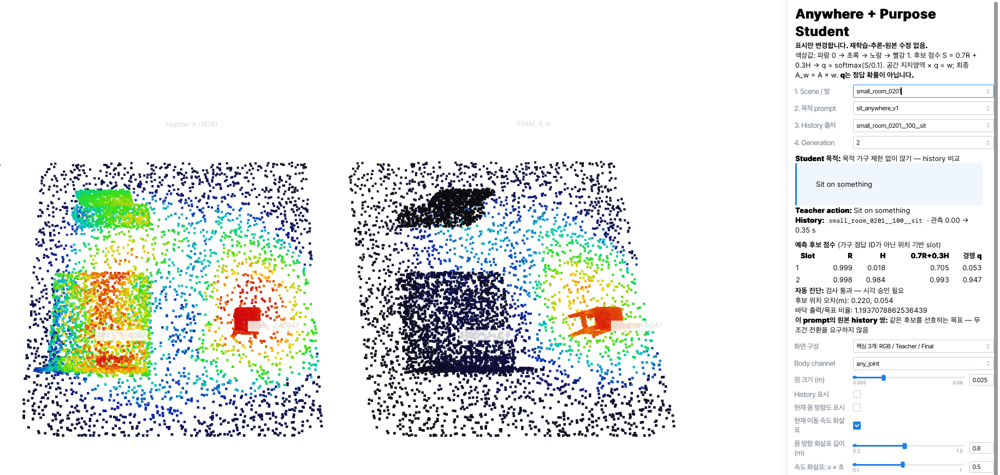

Figure 2a. `room0201.png` · Anywhere · history100 · q=0.053/0.947 · History 표시 OFF.

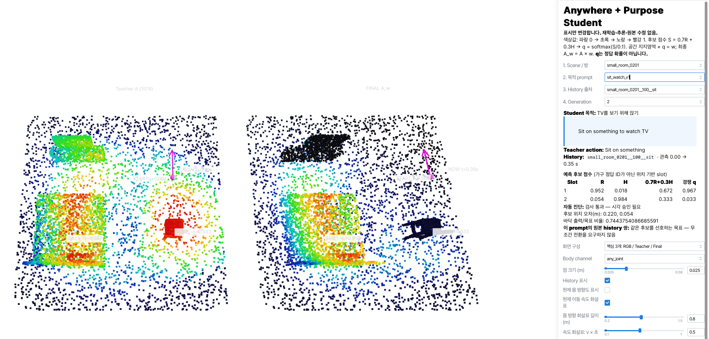

Figure 2b. `room0201_2.png` · TV 목적 · history100 · q=0.967/0.033 · History 표시 ON.

**해석:** 같은 관측 상태에서도 목적 text가 바뀌면 최종 선택이 바뀐다. 이 두 장은 history 전환 실험이 아니다. 원본 room0201의 두 history는 기하학적 목표상 같은 후보를 선호하므로 무조건적인 history 전환을 요구하지 않는다.

## 7. Room0301 — History 선호와 목적 적합성의 충돌

History100과 scene/g2를 고정한다. H=0.030/0.985로 후보2 선호를 유지하지만, Write 목적을 지정하면 Relation이 후보1을 선호하여 최종 선택이 바뀐다.

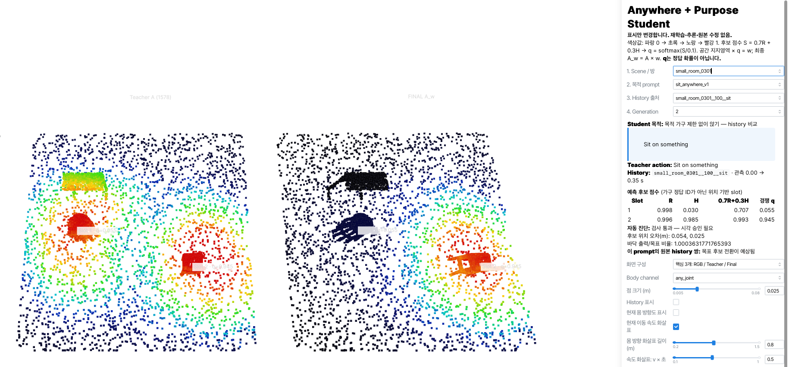

Figure 3a. `room0301.png` · Anywhere · history100 · q=0.055/0.945 · History 표시 OFF.

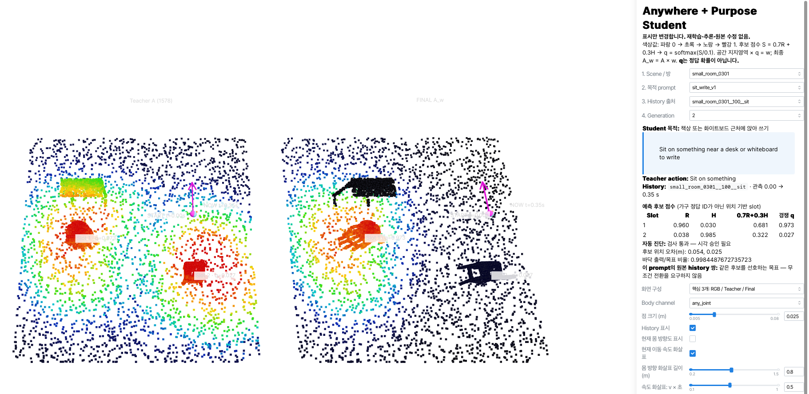

Figure 3b. `room0301_2.png` · Desk or whiteboard to write · history100 · q=0.973/0.027 · History 표시 ON.

**해석:** Anywhere에서는 history가 선택을 주도하고, 목적 조건이 주어지면 목적에 대한 Relation 차이가 선택을 바꿀 수 있다. 이는 목적과 history가 항상 같은 후보를 선호하지 않는다는 것을 보여준다.

## 8. Room0401 — 같은 History에서 목적별 선택

아래 세 장은 모두 history100/g2이다. 첫 장과 세 번째 장은 같은 입력·같은 결과에서 history 표시 여부만 다르므로 독립 실험으로 세지 않는다.

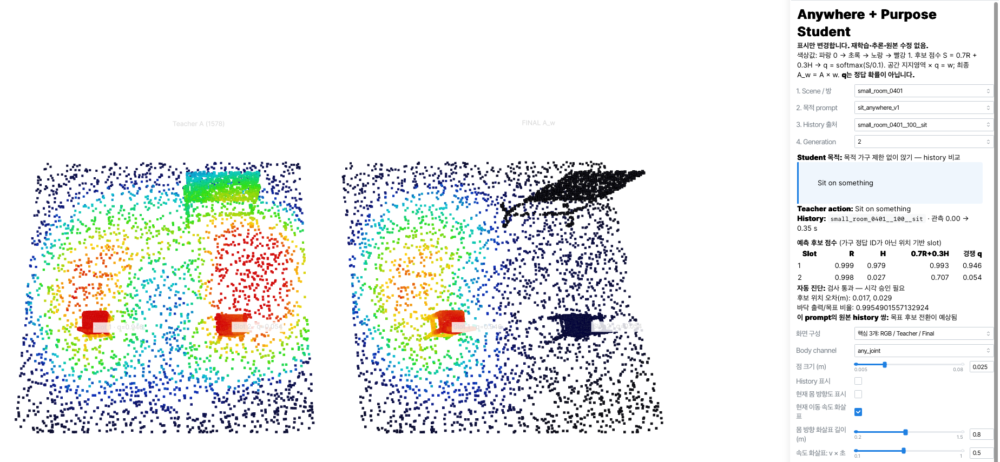

Figure 4a. `room0401.png` · Anywhere · history100 · q=0.946/0.054 · History 표시 OFF.

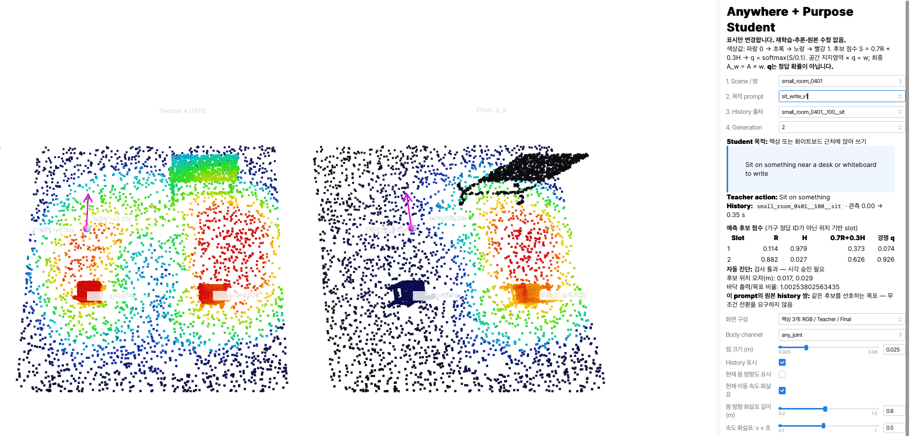

Figure 4b. `room0401_2.png` · Write · history100 · q=0.074/0.926 · History 표시 ON. 목적 조건에 따라 후보2가 우세하다.

Figure 4c. `room0401_3.png` · Anywhere · history100 · q=0.946/0.054 · History 표시 ON. Figure 4a와 같은 조건이다.

**해석:** 목적 비교에는 표시 조건까지 일치하는 Figure 4b–4c가 적합하다. Figure 4a는 원본 기록으로 보존한다.

## 9. Room0501 — TV와 Write의 명확한 목적 비교

Figure 5b–5c는 모두 history110/g2이므로 목적 text만 바뀐 직접 비교이다. Figure 5a는 history100이므로 세 장을 모두 같은 history라고 설명하지 않는다.

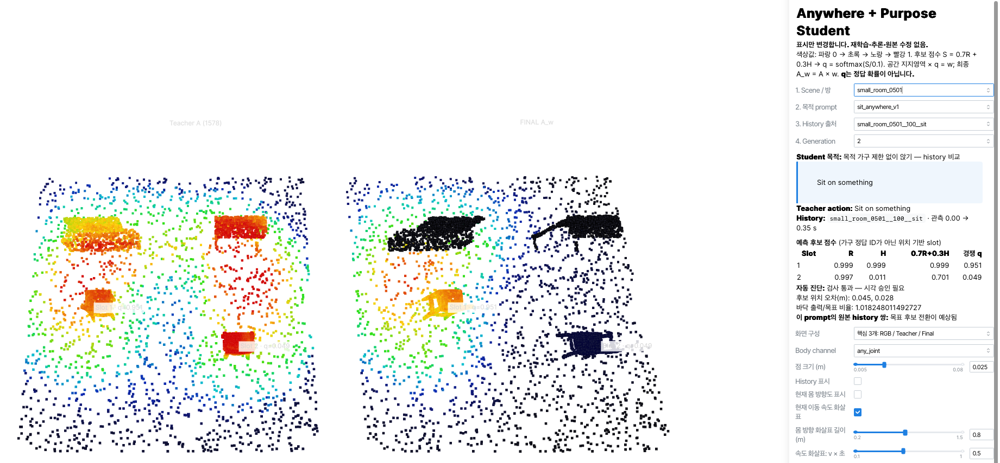

Figure 5a. `room0501.png` · Anywhere · history100 · q=0.951/0.049 · History 표시 OFF.

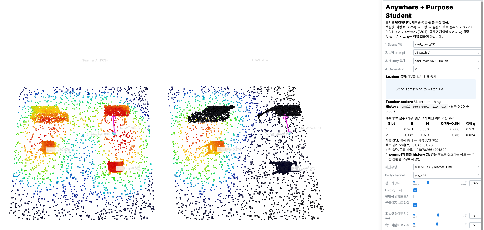

Figure 5b. `room0501_2.png` · TV · history110 · q=0.976/0.024. History는 후보2를 선호하지만 TV 목적에서 후보1이 우세하다.

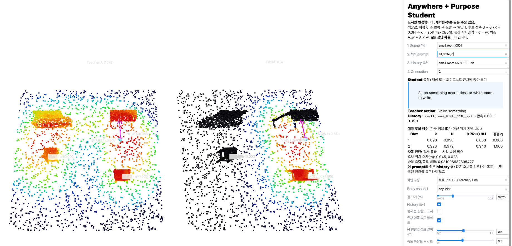

Figure 5c. `room0501_3.png` · Write · history110 · q=0.000/1.000(반올림). 동일 history에서 목적을 Write로 바꾸면 후보2가 우세하다.

**해석:** 같은 관측 상태에서 목적 text가 달라짐에 따라 선택이 바뀌는 대표 사례다. 논문용 text-condition 그림으로 Figure 5b–5c를 우선 사용한다.

## 10. Room0601 — 목적 가구 구분

세 장 모두 history100/g2로 고정되어 있다. 첫 장은 일반 write가 아니라 Anywhere이다. 세 장 모두 history 표시는 OFF이며, 입력 history는 패널에 명시되어 있다.

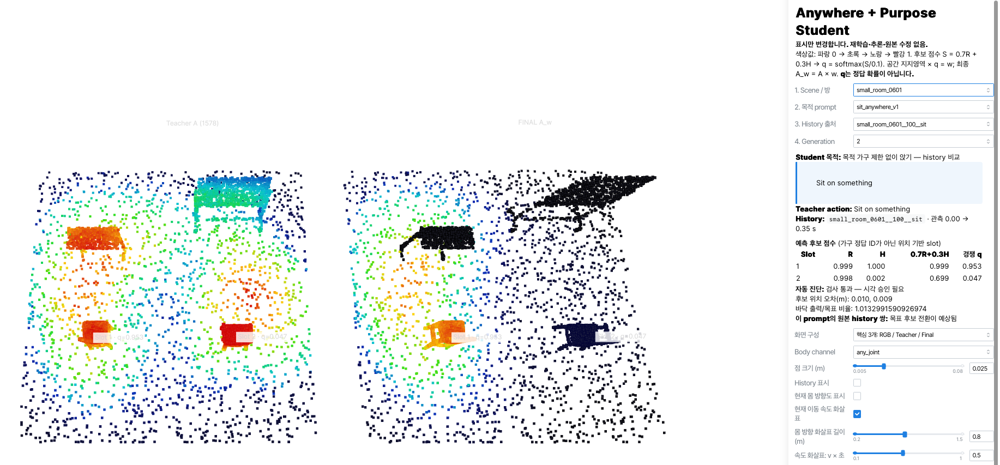

Figure 6a. `room0601.png` · Anywhere · history100 · q=0.953/0.047. R이 두 후보에서 유사하고 history 선호에 따라 후보1이 우세하다.

Figure 6b. `room0601_2.png` · Near a desk to write · history100 · q=1.000/0.000(반올림). 책상 관련 후보1을 강조한다.

Figure 6c. `room0601_3.png` · Near a whiteboard to write · history100 · q=0.071/0.929. H=1.000/0.002로 후보1 선호가 유지되지만, 화이트보드 목적 조건에서 후보2가 우세해진다.

**해석:** 목적 가구를 명시적으로 변경했을 때 같은 history에서도 다른 후보가 선택됨을 보여준다. 목적 3종 × history 2종의 완전한 비교는 이 폴더에 모두 포함되어 있지 않다.

## 11. 결과 요약 및 한계

- **History 기여:** Room0101의 동일 prompt/history 쌍에서 후보 전환이 관찰된다.
- **Text 기여:** Room0501의 history110 TV/Write 쌍, Room0601의 history100 Desk/Whiteboard 쌍에서 목적별 선택이 달라진다.
- **공간 분포:** 최종 지도에서 선택 후보와 관련 바닥 영역은 상대적으로 보존되고 비선택 후보는 억제된다. 정성 관찰이며 전체 보존율 수치로 일반화하지 않는다.
- **경로 아님:** A^w는 이동 경로가 아니다. Teacher 값이 0인 곳에 곱셈만으로 새로운 affordance를 생성할 수 없다. 시작점 주변 map 유무만으로 history 사용 여부를 판단하지 않는다.
- **평가 범위:** 동일 30개 개발 장면의 별도 Teacher 생성 샘플 평가이다. 새로운 방·새로운 prompt 표현에 대한 일반화는 별도 검증이 필요하다.
- **제한된 후보 구성:** 현재 두 앉기 후보 및 TV/desk/whiteboard 범주별 최대 한 객체를 가정한다.
- **전환 기대 구분:** 기하학적 목표 분석에서 25개 방은 history별 우세 후보 전환이 예상되며 0201–0205는 같은 후보를 선호한다. 이는 모델 전환 성공률이 아니다.
- **정량 후속 항목:** 목적 적합 후보 선택률, 전환이 기대되는 쌍의 history 전환 성공률, 최종 map 후보 간 차이, 바닥 관련 영역 보존, anywhere 추가 학습 후 기존 조건 성능 변화를 집계한다. 아직 집계하지 않은 수치는 보고하지 않는다.

## 12. 논문·README 그림 편집 메모

핵심 그림은 Room0101(history 비교), Room0501의 5b–5c(text 비교), Room0601(목적 가구 구분)로 구성한다. 원본 15장은 그대로 보존했다. 최종 논문 그림에서는 동일 카메라·배율·history 표시를 맞추고 RGB 장면 또는 가구 라벨, 읽기 쉬운 제목, 공통 0–1 색상 범례를 추가한다. 서로 다른 체크포인트 결과를 하나의 통제 비교로 혼합하지 않는다. Teacher 패널의 Student slot/q overlay는 명확히 구분한다.
