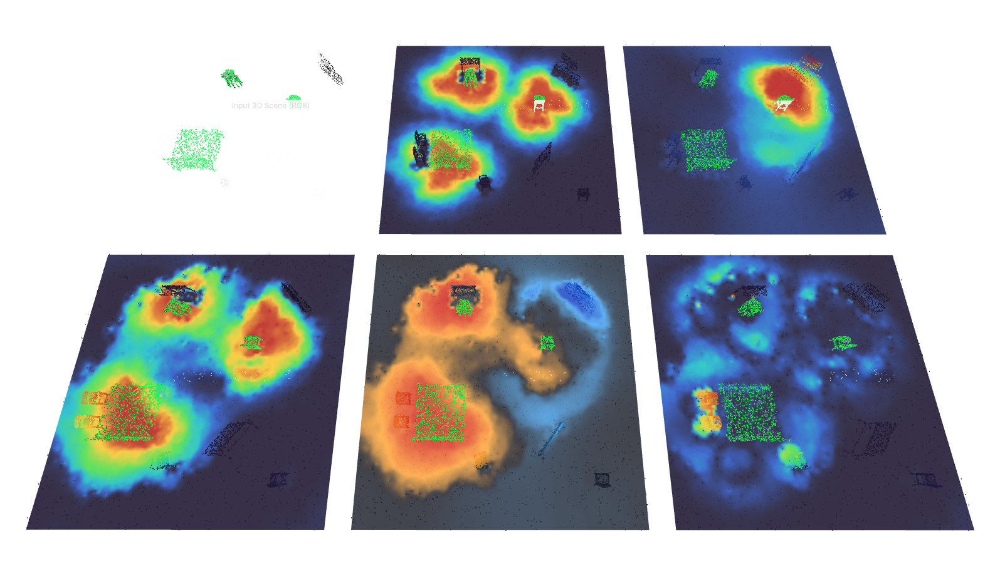

# Teacher-v10.2 result summary

Teacher-v10.2 uses equal-macro dense per-instance supervision for Bed, normal
Chair, and High Chair across `room_0101` and `room_0102`.

## Recorded step-1000 metrics

| Scene | Metric | Bed | Normal Chair | High Chair |
| --- | --- | ---: | ---: | ---: |
| room_0101 | pooled soft recall | 0.9906 | 0.9887 | 0.9886 |
| room_0101 | pooled active-support MAE | 0.0648 | 0.0388 | 0.0327 |
| room_0102 | pooled soft recall | 0.9472 | 0.3414 | 0.9980 |
| room_0102 | pooled active-support MAE | 0.0933 | 0.4929 | 0.0787 |

- v5 fixed-probe change: `+6.321%`
- all-three generations: `0/3` for watch and `0/3` for write in both scenes
- strict result: `FAIL`
- selected step: `None`
- checkpoint: not written

The failure is not a runtime error. It means no candidate satisfied every locked
actual-K3 and v5-retention requirement simultaneously.

## Visualization



Panel order:

```text
Input RGB             All-sittable GT       Frozen v5r4 Base
Teacher-v10.2 result  Candidate - Base      |Candidate - GT|
```

The continuous surface is for display only; metrics use the original 8192
point-aligned values.
